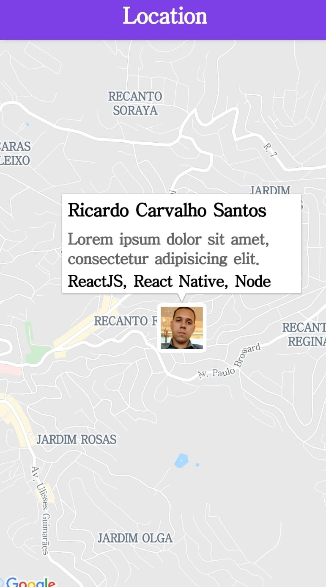

  <h2 align="center"> 
    DevLocation
  </h2>

<p align="center">	
  <a href="https://www.linkedin.com/in/ricardo-carvalho-ba865a123/">
    
  </a> 
</p>


<p align="center">
  <a href="#-Projeto">Projeto</a>&nbsp;&nbsp;&nbsp;|&nbsp;&nbsp;&nbsp;
  <a href="#Layout">Layout</a>&nbsp;&nbsp;&nbsp;|&nbsp;&nbsp;&nbsp;
  <a href="#Tecnologias">Tecnologias</a>&nbsp;&nbsp;&nbsp;|&nbsp;&nbsp;&nbsp;
  <a href="#Como-usar">Como Usar</a>&nbsp;&nbsp;&nbsp;|&nbsp;&nbsp;&nbsp;
  <a href="#Contribuir">Como Contribuir</a>
</p>


## 💻 Projeto

A ideia consiste em uma plataforma mobile para Android e web, 
na qual tem a finalidade de promover o networking entre desenvolvedores de determinadas regiões,
ou até mesmo conectar empresas em buscas de novos colaboradores com os desenvolvedores de sua região.

## Layout
<div align="center" >
  
</div>

## Tecnologias
 
 Este projeto foi desenvolvido usando as tecnologias

- [Nodejs](https://nodejs.org/en/download/)
- [javascript]
- [Mongo]
- [React]
- [React-Native]
- [Expo]

## Como usar

 Para clonar esse repositório você deve ter [Git](https://git-scm.com/), [Node.js](https://nodejs.org/en/download/) + [Yarn](https://classic.yarnpkg.com/pt-BR/docs/install/#windows-stable) instalado em seu computador.

Abra o seu terminal e digite:

### Instalar API 

```bash
# Clone este repositório
$ git clone https://github.com/LucasAmaral42/ies-301.git

# vá para o repositório
$ cd es-301/server

# instale as dependençias
$ yarn install

# rode Migrates
$ yarn knex:migrate

# Run Seeds
$ yarn knex:seed

# Start server
$ yarn dev

# rodando na porta 3333
```

### Instalando Front-end

```bash
# Clone este repositório
$ git clone https://github.com/LucasAmaral42/ies-301.git

# vá para o repositório
$ cd ies-301/web

# instale as dependençias
$ yarn install

# Run
$ yarn start

# rodando na porta 3000
```

### Instalando Mobile

```bash
# Clone este repositório
$ git clone https://github.com/LucasAmaral42/ies-301.git

# vá para o repositório
$ cd ies-301/mobile

# instale as dependençias
$ yarn install

# Run
$ yarn start

# Expo vai abrir, você deve escanear o QRCODE que aparecerá em seu terminal ou na pagina do Expo.

```

## Contribuir

##### **Para o nome dos arquivos, deve ser usado esse padrão:**

`trab_shigueo_23-03v1` |
**Nome_do_arquivo**_**dd-mm**_v(Nº da versão do dia)

